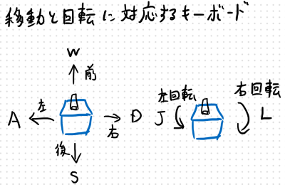

# research_shooter_agents

**検証活動のご参加の際には、このREADME.mdをよく読んだ上で行うようにお願いいたします。m( _ _ )m**

## PDⅢ検証用リポジトリ

このリポジトリは、PDⅢの研究で実装した、ゲームAIの有効性を確かめるため、実装したゲームAIを対戦相手としたゲームのプレイと、対戦相手の様子をアンケート調査を行うためのものです。このリポジトリでは、そのゲームデータとアンケートフォームのリンクが含まれます。

## 研究概要

テーマ名：「戦局認識型ゲームAIの実装」

本研究の目的は、試合形式のゲーム上で、機械学習を利用し、スコアから読み取れる対戦の優劣によって、一方的な試合を回避するように学習させ、プレイヤーとエージェントとの実力差を感じさせないゲーム体験を目指すことです。

## 検証方法

検証は以下の手順で行います。

1. 検証用アプリケーションのZipを[ダウンロード](#検証用アプリのダウンロード)
1. Zipを解凍し、ファイルの中にある、「ShooterAgents.exe」を起動(すぐにゲームが開始されます)。
1. [操作方法](#ゲームの操作方法)と[ゲームのルール](#ゲームの主なルール)に従って、何試合か(回数は任意)ゲームをプレイ。
1. アプリケーションを閉じて、[アンケートフォーム](#アンケートフォーム)に解答を入力。

## ゲームについて

本研究で作成したゲームは対戦型のシューティングゲームです。以下は、ゲームの操作方法と大まかなルールを説明します。

### ゲームの操作方法

このゲームは主にキーボードで操作します。

キャラクター操作方法は以下の通りです。

- 移動：  WASDキーで、前後左右に移動
- 回転：  JとLキーで左右に回転
- 弾丸発射:　spaceキーで弾丸をキャラクターの前方に発射(長押しすると連続して発射可能)

### ゲームの主なルール

検証用のゲームの主なルールは以下の通りです。

- 両者とも、前後左右の移動と、左右の回転ができる。
- 弾丸はキャラクターの前方に発射できるが、弾丸発射後0.5秒間は次の弾丸を発射できない。
- 弾丸を相手にヒットさせることで、相手にダメージを与えることができる。
- 相手のHPを先に0にすることで得点できる。(得点時には、初期位置に戻される)
- 先に5得点先取で勝利(得点と位置がリセットされ、再度ゲームがスタートする)

## 検証用アプリのダウンロード

以下のリンクから、検証用アプリケーションをダウンロードしてください。

[ダウンロードリンク(testAppData.zip)](https://github.com/KenjiIsAEiji/research_shooter_agents/releases/download/v0.1-pre-release/testAppData.zip)

(Zip状態で約29MB、解凍後は約73.8MB）

このGitHubの[Releases](https://github.com/KenjiIsAEiji/research_shooter_agents/releases)から、Assetsのプルダウンの中にある「testAppData.zip」でもダウンロードできます。

## アンケートフォーム

ゲームをプレイした際に感じた、対戦相手の戦い方に関してアンケート調査にご協力お願いします。

以下のGoogleフォームのリンクにアクセスし、アンケートの解答を入力してください。

このアンケートで得た情報は、PDⅢの研究による検証や論文などにのみ使用・公開されますので、予めご了承ください。

## Note

注意点などがあれば書く

## Author

作成情報を列挙する

* 作成者
* 所属
* E-mail
